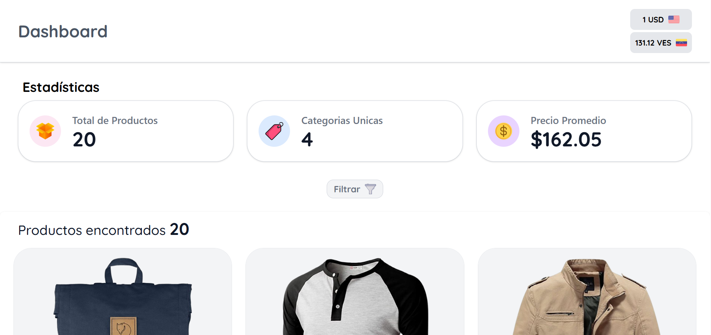

# Dashboard Retail

## 📁 Requerimientos

Antes de comenzar, asegúrate de tener instalado:
- Node.js versión 18 o superior
- npm o yarn como gestor de paquetes

## ⬇️ Instalacion
- Clonar el proyecto
~~~
git clone https://github.com/juandurandev/dash-rotary
~~~
- Clonar el proyecto
~~~
cd dash-rotary
~~~
- Instalar dependencias
~~~
npm install
~~~
- Ejecutar
~~~
npm run dev
~~~

## Live demo
https://dash-rotary.vercel.app/

## Imagenes

## Decisiones Técnicas
#### Manejo del estado local
  - No se uso pinia por simplicidad 
#### Libreria toastify
  - Para las notificaciones push
#### Separacion de componentes
  - Para facilitar el mantenimiento